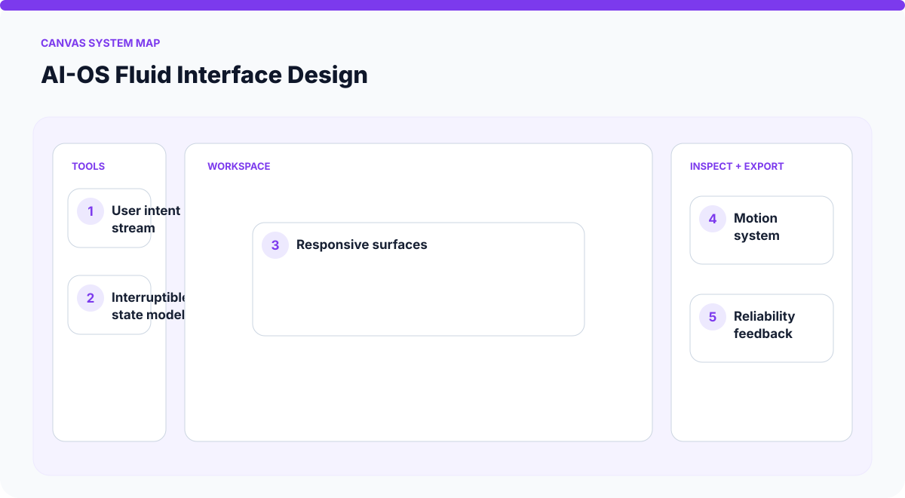
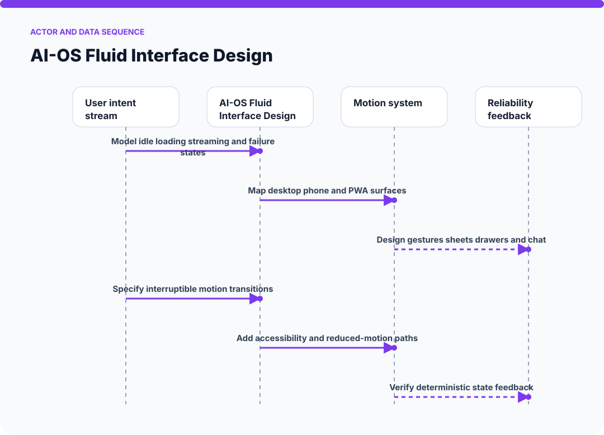
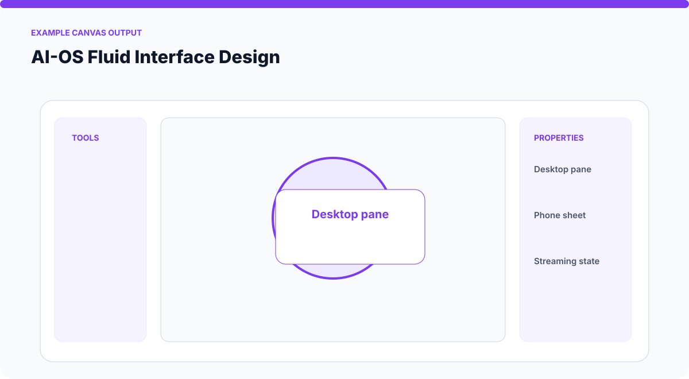
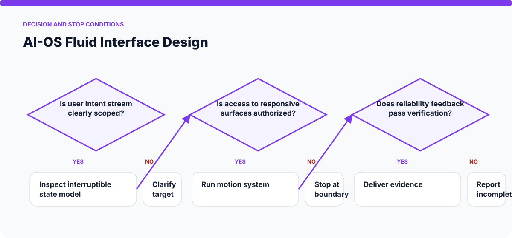

# How AI-OS Fluid Interface Design Works

The visuals on this page are static SVGs, so they render directly on GitHub on phones and desktop browsers. Each one is generated from a model specific to this skill.

## System architecture

### Components

- **1. User intent stream:** participates in model idle loading streaming and failure states.
- **2. Interruptible state model:** participates in map desktop phone and pwa surfaces.
- **3. Responsive surfaces:** participates in design gestures sheets drawers and chat.
- **4. Motion system:** participates in specify interruptible motion transitions.
- **5. Reliability feedback:** participates in add accessibility and reduced-motion paths.

## Actor and data sequence

### 1. Model idle loading streaming and failure states

**Primary surface:** `User intent stream`

Record the concrete input, the operation performed, and the evidence produced at this stage. Continue only when the output is sufficient for the next stage; otherwise preserve the blocker and stop.
### 2. Map desktop phone and PWA surfaces

**Primary surface:** `Interruptible state model`

Record the concrete input, the operation performed, and the evidence produced at this stage. Continue only when the output is sufficient for the next stage; otherwise preserve the blocker and stop.
### 3. Design gestures sheets drawers and chat

**Primary surface:** `Responsive surfaces`

Record the concrete input, the operation performed, and the evidence produced at this stage. Continue only when the output is sufficient for the next stage; otherwise preserve the blocker and stop.
### 4. Specify interruptible motion transitions

**Primary surface:** `Motion system`

Record the concrete input, the operation performed, and the evidence produced at this stage. Continue only when the output is sufficient for the next stage; otherwise preserve the blocker and stop.
### 5. Add accessibility and reduced-motion paths

**Primary surface:** `Reliability feedback`

Record the concrete input, the operation performed, and the evidence produced at this stage. Continue only when the output is sufficient for the next stage; otherwise preserve the blocker and stop.
### 6. Verify deterministic state feedback

**Primary surface:** `User intent stream`

Record the concrete input, the operation performed, and the evidence produced at this stage. Continue only when the output is sufficient for the next stage; otherwise preserve the blocker and stop.

## Example output shape

The example is a visual contract: a real run may look different, but it should expose comparable state, provenance, and verification information. It is not presented as evidence of a live external action.

## Decision and stop conditions

The workflow stops when the target is ambiguous, the relevant surface is unavailable or unauthorized, or the final artifact cannot be checked. A logged-in session or successful tool call is not by itself proof that the requested outcome is complete.

## Verification checklist

- Confirm every component shown in the system map exists in the target environment.
- Trace the actor sequence using actual tool output or artifact state.
- Compare the result with the example-output information contract.
- Re-read or reopen the final artifact instead of trusting an attempt message.
- Report omitted stages, unsupported capabilities, and remaining human decisions.
