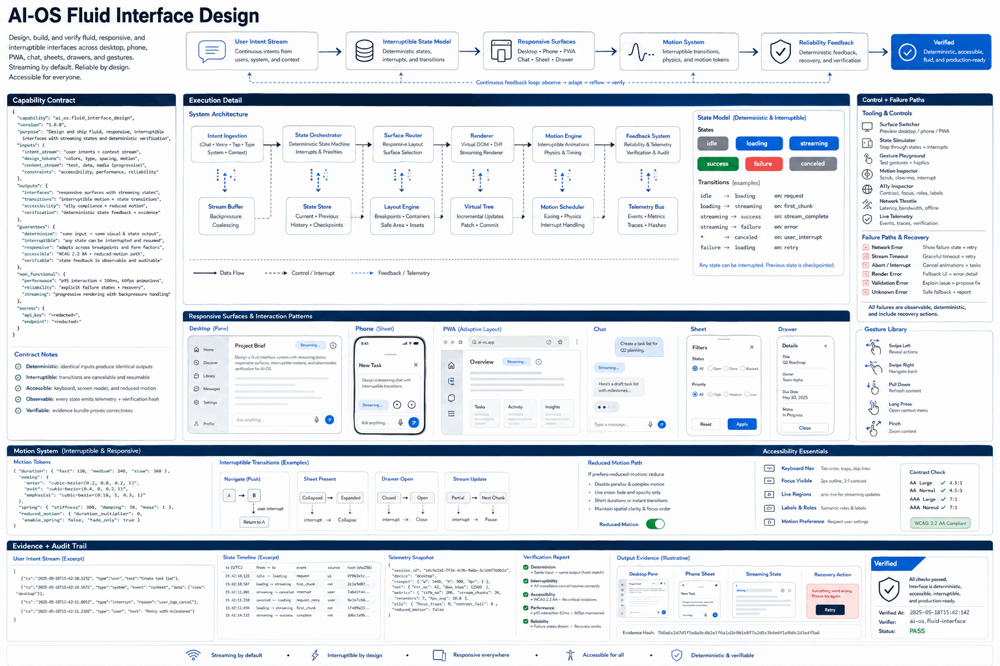

# How AI-OS Fluid Interface Design Works

Use when building or reviewing AI-OS, Hermes, dashboard, desktop, phone/PWA, chat, sheet, drawer, gesture, motion, or streaming-state interfaces. Apply fluid, responsive, interruptible behavior with accessibility and deterministic verification.

## Stages

### 1. Model idle loading streaming and failure states

**Primary surface:** `User intent stream`

Record the input, operation, observable output, and any decision that changes scope. Stop here if the output is missing, contradictory, or insufficient for the next stage.
### 2. Map desktop phone and PWA surfaces

**Primary surface:** `Interruptible state model`

Record the input, operation, observable output, and any decision that changes scope. Stop here if the output is missing, contradictory, or insufficient for the next stage.
### 3. Design gestures sheets drawers and chat

**Primary surface:** `Responsive surfaces`

Record the input, operation, observable output, and any decision that changes scope. Stop here if the output is missing, contradictory, or insufficient for the next stage.
### 4. Specify interruptible motion transitions

**Primary surface:** `Motion system`

Record the input, operation, observable output, and any decision that changes scope. Stop here if the output is missing, contradictory, or insufficient for the next stage.
### 5. Add accessibility and reduced-motion paths

**Primary surface:** `Reliability feedback`

Record the input, operation, observable output, and any decision that changes scope. Stop here if the output is missing, contradictory, or insufficient for the next stage.
### 6. Verify deterministic state feedback

**Primary surface:** `Reliability feedback`

Record the input, operation, observable output, and any decision that changes scope. Stop here if the output is missing, contradictory, or insufficient for the next stage.

## Failure handling

- **Authorization failure:** do not probe credentials or broaden access; report the missing authority.
- **Target ambiguity:** stop before mutation and request the minimum identifying information.
- **Tool or service failure:** retain error evidence, retry only safe transient failures, and cap retries.
- **Verification failure:** classify the run as incomplete even when the preceding operation returned success.

## Completion evidence

The handoff should contain the original request, inspection state, preview or plan, exact execution result, direct verification, and a final receipt naming limitations and withheld actions.
